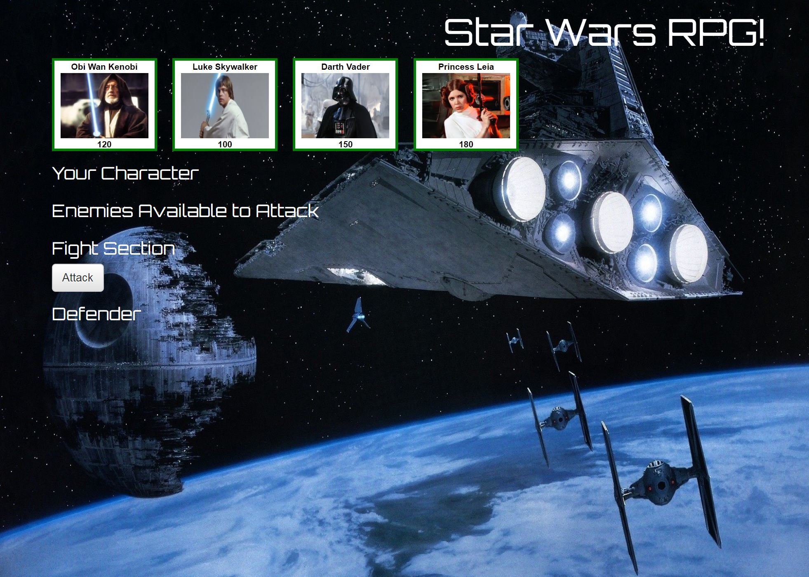
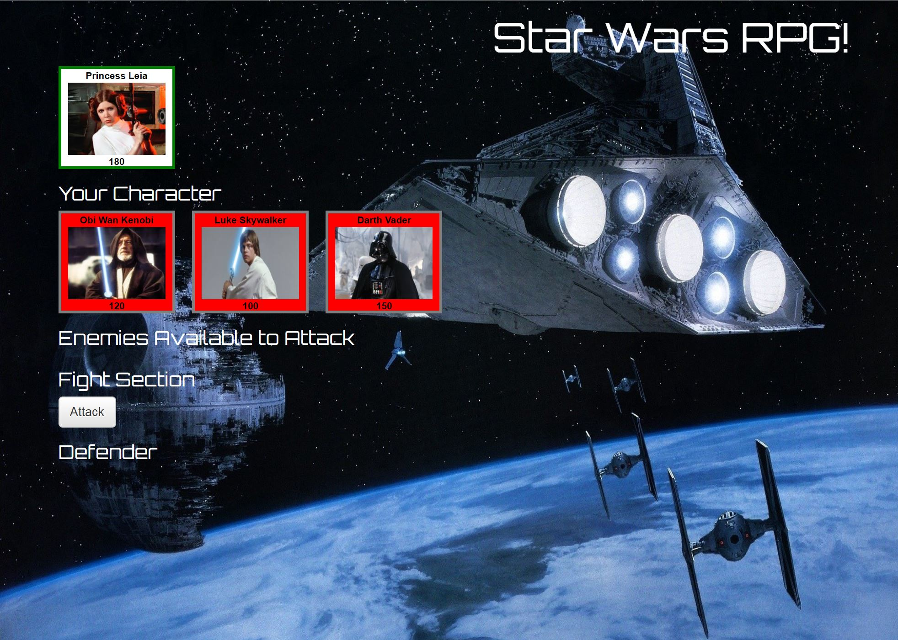
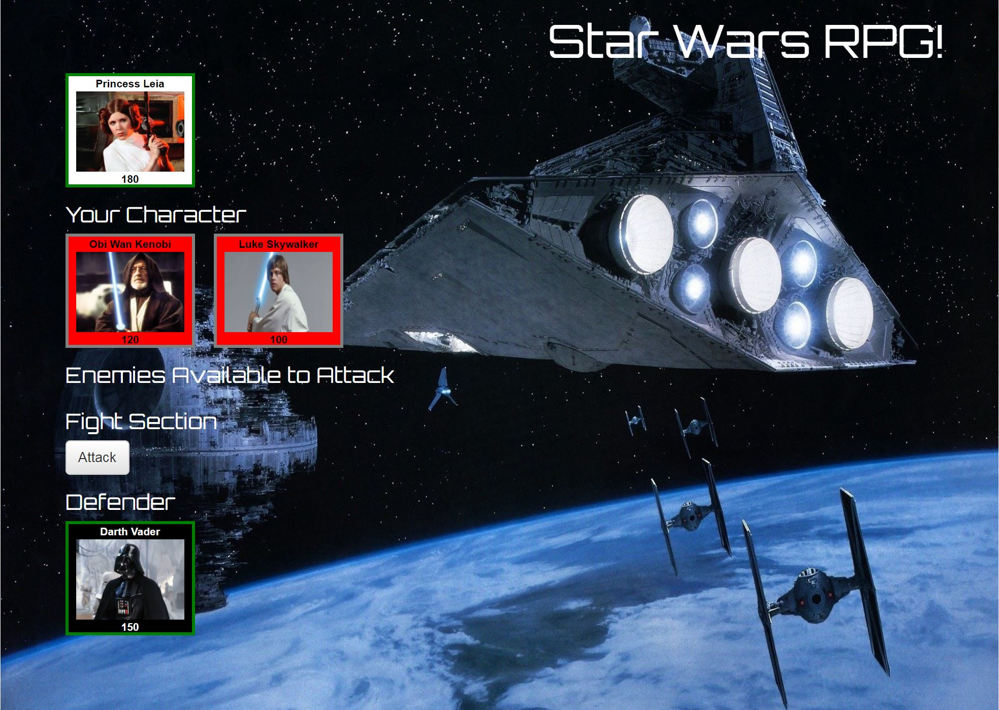
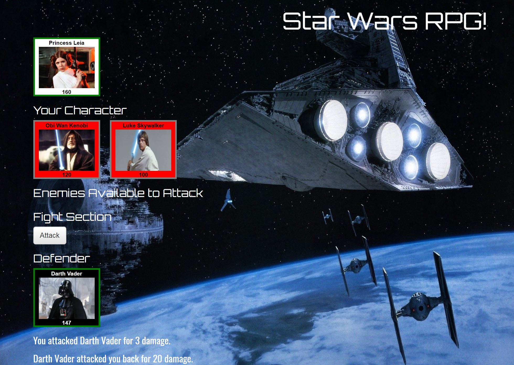

# Stars Wars RPG Game

Star Wars uses JavaScript and jQuery to create an interactice role playing game. The application is developed using an Object-oriented approach and makes use of constructor classes to represent the characters.

Each character in the game has three attributes: Health Points, Attack Power and Counter Attack Power.

The user first chooses a character for the game and then chooses an enemy defender. The fight now begins. The character attacks followed by an enemy defender counter attack. Each time the character attacks, the Attack Power increases by a base Attack Power. The enemy defender always attacks with the same Counter Attack Power. Points are deducted from each fighter's Health Points. The first fighter to zero (or less) Health Points loses the fight. If the character wins the fight, the character lives to choose another opponent. The character must win all fights to win the game. If the character loses at any time, the game is over.

## Site Preview

## Getting Started

You should be able to download the files via the github pages link below and run locally on your computer:

[https://github.com/emswann/StarWarsRPG.git](https://github.com/emswann/StarWarsRPG.git).

You can also access the application via the github pages link below:

[https://emswann.github.io/StarWarsRPG/](https://emswann.github.io/StarWarsRPG/).

## Prerequisites

No prior software needed to run.

## Built With

* [Bootstrap](https://getbootstrap.com/docs/3.3/) - Front-end HTML, CSS, javascript framework for creating responsive web applications. 
* [JavaScript](https://www.javascript.com/) - Programming language.
* [jQuery](https://jquery.com/) - Javascript library.

## Contributing

Please feel free to offer any suggestions. As always, programming is a work of art in progress.

## Author

* **Elaina Swann** - [Github](https://github.com/emswann)
